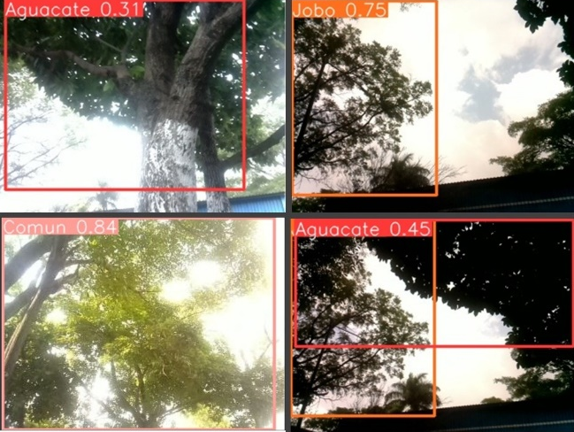
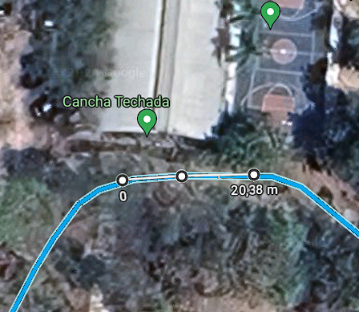

# 🤖 Inventariado Forestal Automatizado con Visión por Computadora

Sistema embebido que permite registrar e identificar especies arbóreas mediante visión artificial y navegación autónoma con GPS. 
El prototipo, construido sobre un carro robot tipo Raspbot con Raspberry Pi 4, captura imágenes, las geolocaliza y aplica un modelo de IA entrenado con YOLOv5 para la clasificación de árboles.

## 🛠️ Funcionalidades principales

| Categoría              | Tecnologías                                  |
|------------------------|----------------------------------------------|
| Lenguaje               | Python                                       |
| Visión por computadora | OpenCV, YOLOv5, Roboflow                     |
| IA y entrenamiento     | Google Colab, RoboFlow                       |
| Persistencia           | TinyDB (NoSQL embebido)                      |
| Hardware embebido      | Raspberry Pi 4, Cámara RPi Rev 1.3, GPS NEO-6M, Arduino UNO |
| Comunicación           | Bluetooth (control manual), Serial (GPS)     |

## ⚙️ Funcionalidades principales

- **Captura automatizada** de imágenes geolocalizadas con cámara RPi.
- **Navegación autónoma** a coordenadas objetivo utilizando GPS.
- **Control manual por Bluetooth** para pruebas en áreas sin red.
- **Clasificación de árboles** (aguacate, jobo, sombra) con modelo YOLOv5.
- **Registro estructurado** en base de datos TinyDB con coordenadas, hora y ruta de imagen.

## 🧪 Resultados

Las pruebas de campo se realizaron en el campus del Instituto Tecnológico de Tuxtla Gutiérrez, identificando árboles reales en recorridos cortos (9–13 metros). 
Se identificó una mejora necesaria en rutas largas, debido a limitaciones en el algoritmo de navegación. El modelo de IA demostró un rendimiento sólido en detección, con margen de mejora si se amplía el dataset.

### 📸 Vistas del prototipo en funcionamiento

#### Detección de árboles en tiempo real

#### Prototipo del robot montado

#### Área utilizada para pruebas de campo

